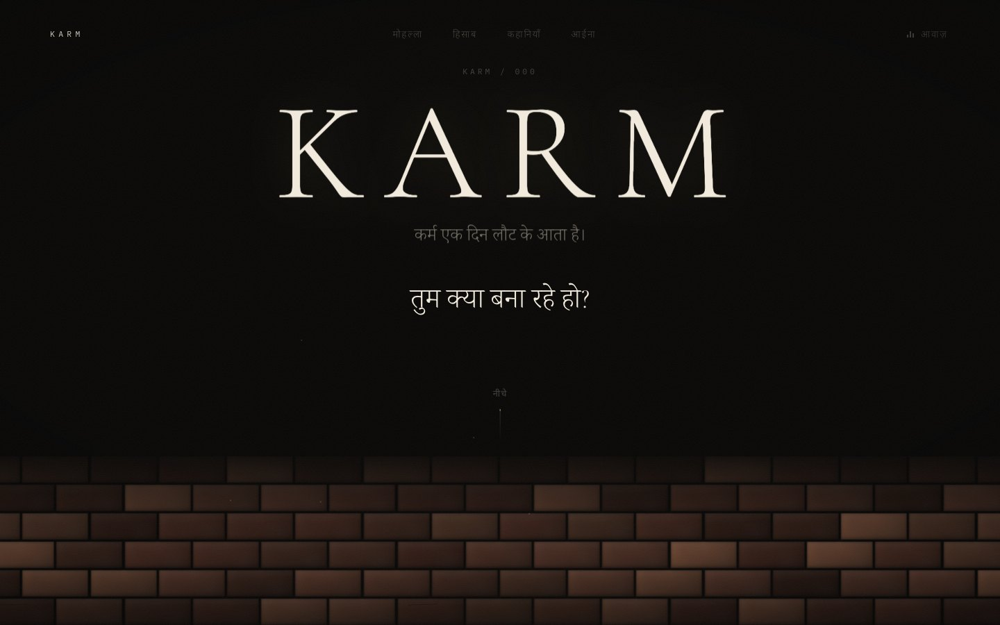
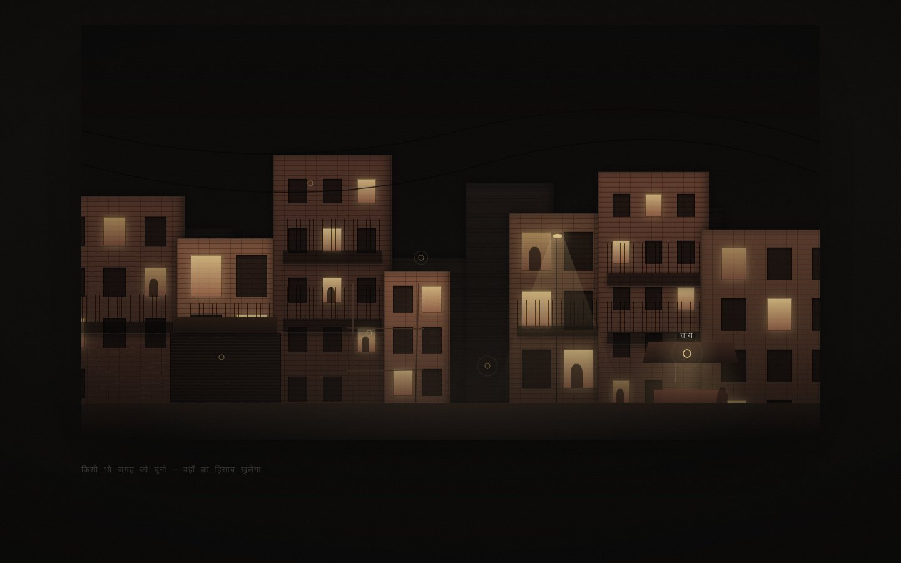
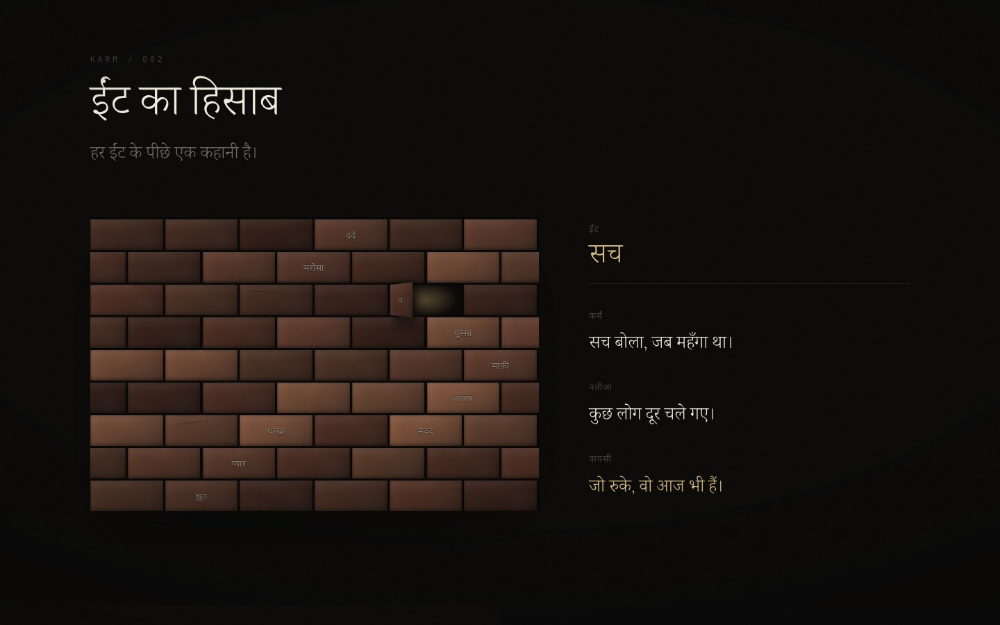
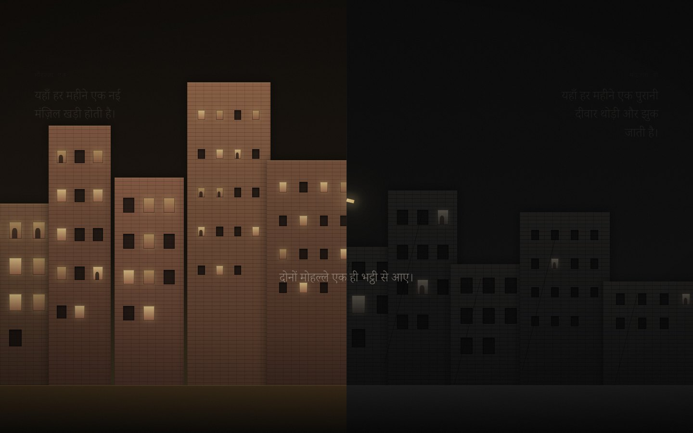
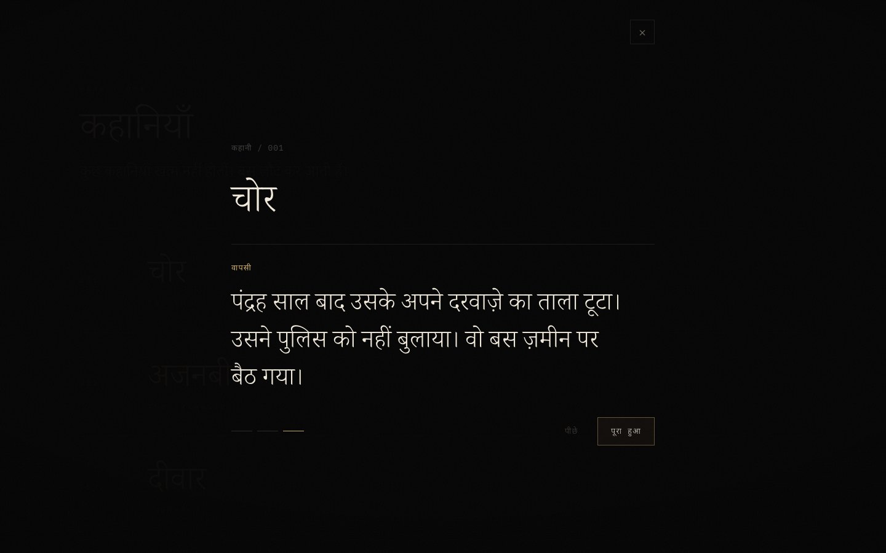
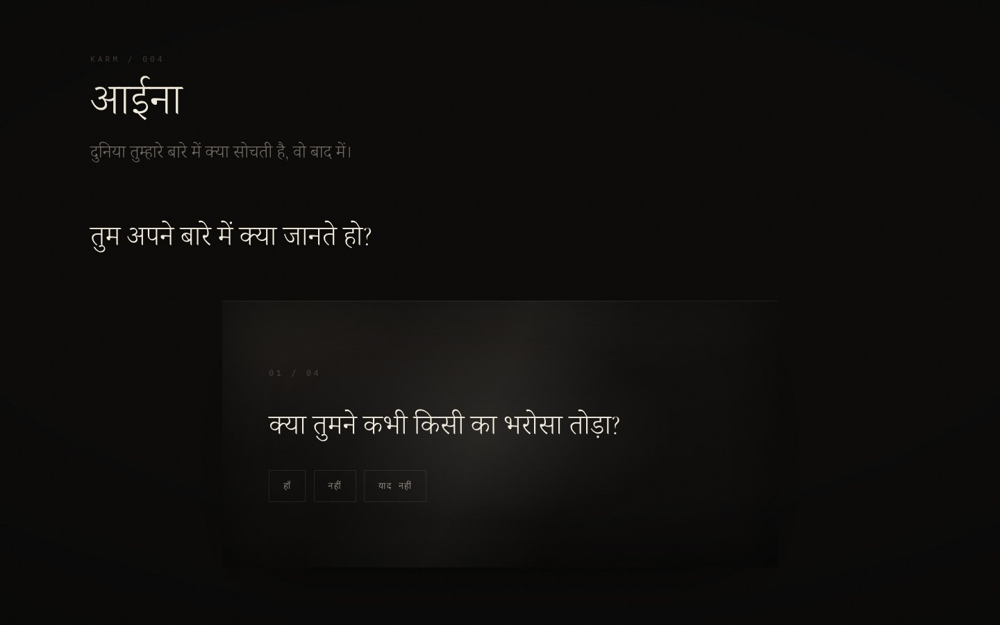
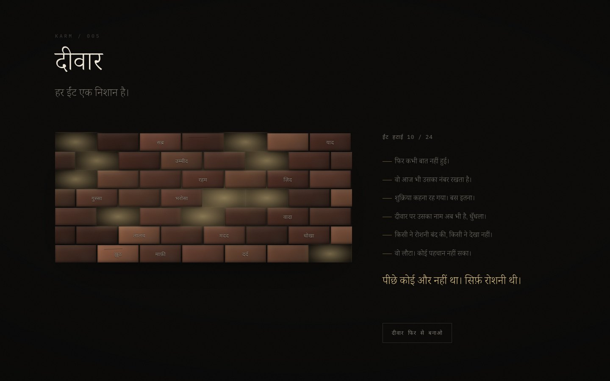
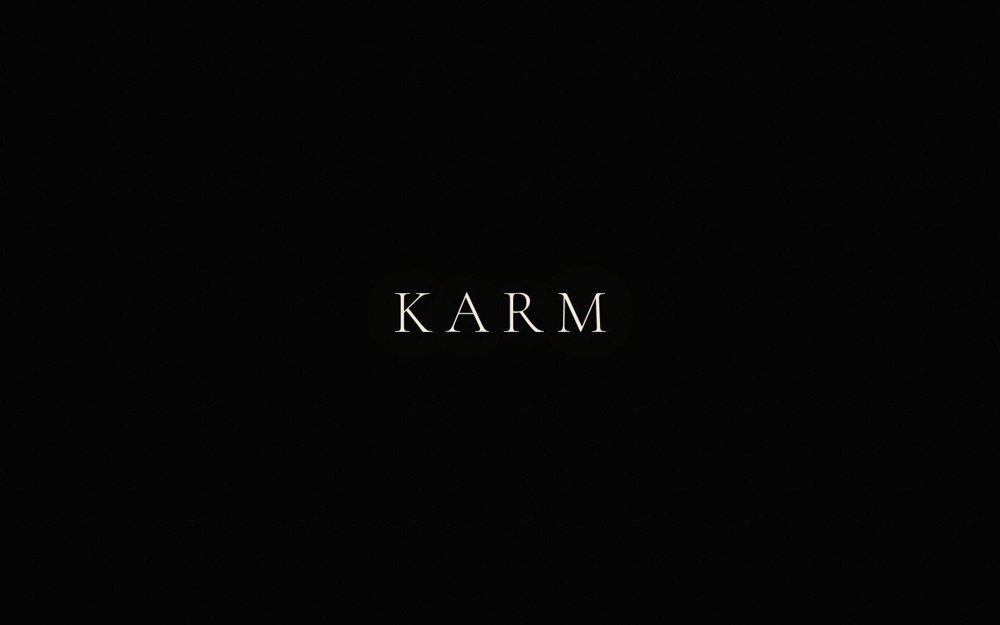
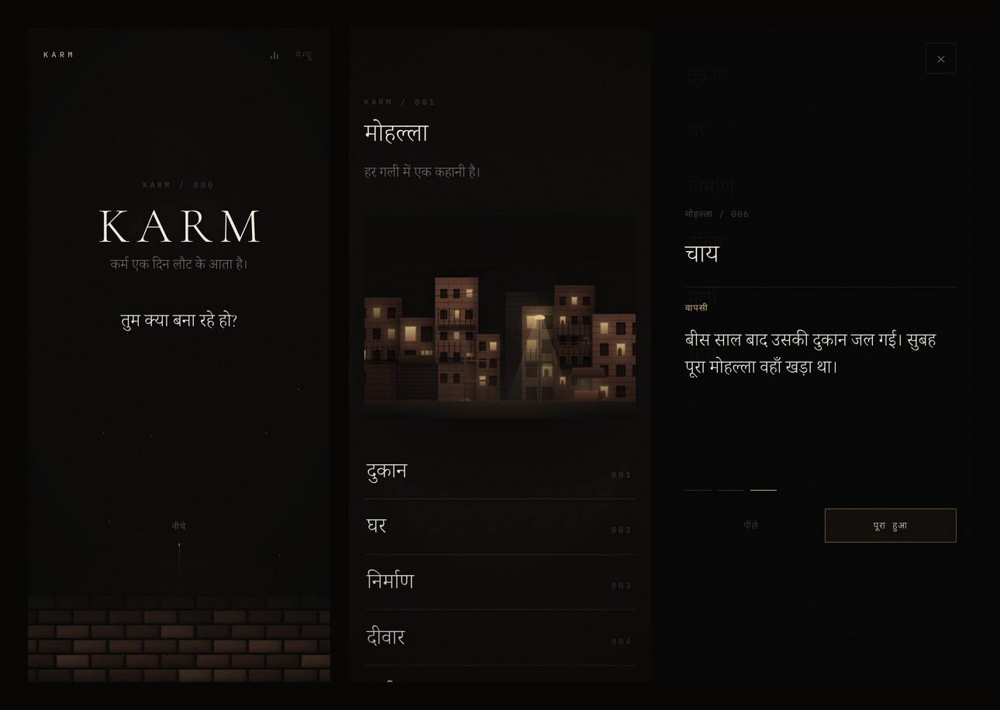

# KARM

> Karm ek din laut ke aata hai.



A lane at three in the morning. A wall that builds itself one brick at a time. Ten accounts that settled themselves, six short films, four questions nobody scores, and a wall you take apart with your own hands.

**KARM** is an immersive, scroll-driven web experience about the one law nobody escapes:

<p align="center"><strong>ACTION → CONSEQUENCE → RETURN</strong></p>

> एक मोहल्ले में ईंट लगी सोने की,<br>
> एक मोहल्ले से आवाज़ आए रोने की।
>
> <sub><i>In one mohalla, a brick of gold was laid. From another came the sound of weeping.</i></sub>

Written in Hindi. Built by hand in HTML, CSS and JavaScript, with no framework, no image assets and no audio files.

---

## About

KARM treats every act as a brick. What you lay down stays in the wall, and sooner or later the wall comes back to you.

The piece unfolds in eight movements, read by scrolling. Every story inside it moves in the same three beats: **कर्म** (the act), **नतीजा** (the consequence), **वापसी** (the return).

Everything on screen is drawn with CSS and assembled at runtime. The walls are laid in running bond by JavaScript, the skylines are built from data, and the ambience is synthesised live in the browser.

## Experience

### 000 — The Return

Bricks fall out of the dark and land one by one until they become a wall. Two lines surface: *हर काम एक ईंट है। तुम क्या बना रहे हो?* (Every act is a brick. What are you building?) Scroll, and the camera pushes into the wall and through it.

### 001 — Mohalla

A night lane in layered parallax: lit windows, a street lamp, a chai stall, scaffolding. Six places (दुकान, घर, निर्माण, दीवार, गली, चाय) each open their own account in three beats.



### 002 — ईंट का हिसाब

A wall with ten words in it: झूठ, प्यार, धोखा, मदद, सच… Choose a brick and it swings open on its edge. Behind it: the act, the consequence, the return.



### 003 — दो मोहल्ले

A scroll-scrubbed split screen. In one mohalla a new floor rises every month; in the other an old wall leans a little further. A single golden brick crosses the seam, because both came from the same kiln. Then the screen goes dark on the couplet.



### 004 — कहानियाँ

An index rather than a card grid. Six short films (The Thief, The Stranger, The Wall, The Promise, The Silence, The Help), each played in the same three-beat sequence.



### 005 — आईना

Four questions. Answer, and the mirror answers back. Nothing is scored and nothing is saved. It ends on one line and a held pause: *हिसाब किसी और का नहीं। तुम्हारा है।* (The account is no one else's. It's yours.)



### 006 — दीवार

A wall of up to twenty-four words. Pull one out and light comes through the gap, along with a fragment of someone's story. The more you remove, the brighter it gets, until nothing is left to hide.



### 007 — The Return

The room goes black. The last lines arrive one at a time, the navigation steps away, and KARM returns to where it began.



## Features

- **Cinematic scroll experience.** Sticky, scroll-scrubbed scenes driven by one shared animation loop.
- **Interactive Mohalla.** Six hotspots in a parallax lane, which become a full-width index on small screens.
- **Interactive brick walls.** Procedural running bond, re-laid on resize. Bricks swing open in ईंट का हिसाब and come out in दीवार.
- **Action → Consequence → Return.** One storytelling rule across every movement.
- **Three-beat story system.** A single sequence player serves both the Mohalla places and the Kahaniyan films. All writing lives in `data/`.
- **Hindi Devanagari typography.** Noto Serif and Noto Sans Devanagari paired with Cormorant Garamond, Inter and IBM Plex Mono, plus a dedicated layer that removes synthetic italics and Latin tracking and re-measures leading for Devanagari.
- **Web Audio soundscape.** Synthesised live and off until you turn it on.
- **Keyboard navigation.** Every interaction is reachable from the keyboard. Arrow keys step through stories and Escape closes.
- **Accessible interactive elements.** Native buttons, a labelled modal dialog, live regions and state attributes.
- **Reduced-motion support.** The same story, without the choreography.
- **Responsive mobile experience.** Layouts rebuilt for phones, not just scaled down.
- **GPU-friendly animation.** Transforms and opacity driven by CSS custom properties.
- **Vanilla JavaScript architecture.** ES modules, no framework, zero runtime dependencies.

## Tech Stack

| Technology | Role |
|---|---|
| **HTML5** | Semantic sections, native `<button>`s, a modal dialog built on `inert` |
| **CSS3** | Custom properties, sticky positioning, `clamp()` type scale, keyframes, `svh` units, `text-wrap` |
| **JavaScript** | ES modules, no framework, no runtime dependencies |
| **Web Audio API** | Synthesised ambience and brick sounds |
| **Browser APIs** | `requestAnimationFrame`, `IntersectionObserver`, `matchMedia` |
| **Fonts** | Cormorant Garamond, Inter, IBM Plex Mono, Noto Serif Devanagari, Noto Sans Devanagari (Google Fonts) |
| **Vite** | Dev server and production build only; the single dev dependency |
| **GitHub Actions** | Build and deploy to GitHub Pages |

## Architecture

```
karm/
├── index.html           application shell: every movement's markup, in order
├── favicon.svg
├── vite.config.js       relative base for Pages; absolute og:image at deploy time
├── assets/images/       social preview image
├── data/                the writing, as plain ES modules
│   ├── places.js          001 · six places in the Mohalla
│   ├── actions.js         002 · ten bricks of ईंट का हिसाब
│   ├── scene.js           skyline geometry for 001 and 003
│   ├── stories.js         004 · six films
│   ├── questions.js       005 · four questions and their echoes
│   └── fragments.js       006 · words, fragments and marks
├── scripts/
│   ├── main.js            boots each movement in isolation
│   ├── components/        one module per movement, plus Navigation and StoryOverlay
│   └── lib/               dom helpers · motion (rAF loop, reveals) · wall geometry · sound
├── styles/              base.css for tokens, one sheet per movement, devanagari.css last
└── docs/screenshots/
```

- **Movements are independent.** Each exports an `init*()` function, and `main.js` runs them one at a time inside `try/catch`, so a failure in one section cannot take down the rest.
- **Scroll is read once and written once per frame.** Scenes register with `onScene()`. A single `requestAnimationFrame` loop measures them and writes one custom property per scene (`--p`, `--sp`, `--tp`); CSS does the choreography.
- **Every wall comes from `lib/wall.js`,** which holds the running-bond geometry, per-brick clay tones and the interactive slots.
- **Content is data.** Rewriting a story means editing `data/`, not the components.

## Local Development

Requires Node.js 20.19+ or 22.12+.

```bash
git clone https://github.com/tanmaytyagii/karm.git
cd karm
npm install
npm run dev        # http://localhost:5173
```

```bash
npm run build      # production build → dist/
npm run preview    # serve dist/ at http://localhost:4173
```

## Deployment

[`.github/workflows/deploy.yml`](.github/workflows/deploy.yml) builds the site and publishes `dist/` to GitHub Pages on every push to `main`. It can also be run by hand from the Actions tab.

One-time setup: **Settings → Pages → Build and deployment → Source: GitHub Actions**.

The build uses relative asset paths, so it works under any repository name. The workflow passes the Pages URL to the build so the social preview image gets the absolute URL that link previews require.

## Accessibility

- **Semantic controls.** Hotspots, bricks, places, stories and answers are native `<button>`s with Hindi labels. A skip link leads straight to the main content.
- **Keyboard.** Tab reaches every interactive element, and Enter or Space activates it. In the story player, ← and → step between beats.
- **Escape** closes the story player, closes the mobile menu, and shuts an open brick in ईंट का हिसाब.
- **Focus handling.** Opening a story moves focus to its close button and keeps Tab inside the dialog. The page behind becomes `inert` and stops scrolling, and on close, focus returns to whatever opened the dialog. The same return happens for the mobile menu and for bricks. Focus rings appear for keyboard users only, via `:focus-visible`.
- **Accessible overlays.** The story player is a `role="dialog"` with `aria-modal` and a labelled title. Changing content (story beats, the ईंट का हिसाब panel, the mirror, the दीवार fragments) is announced through `aria-live`, and toggles report their state with `aria-pressed` and `aria-expanded`. Purely decorative layers are hidden from assistive technology.
- **Language.** Hindi is marked `lang="hi"`, so screen readers pronounce it correctly and the Devanagari typography layer applies to it.
- **Reduced motion.** With `prefers-reduced-motion`, the wall arrives already built, both hero lines appear together, dust, parallax and smooth scrolling are off, the long scroll scenes are shorter, and overlays open and close without transitions.
- **Mobile.** The Mohalla hotspots become a list of full-width buttons, and the menu is a full-screen panel that closes with Escape.

## Performance

- **No framework runtime.** The entire experience ships as about 12 KB of JavaScript and 10 KB of CSS, gzipped.
- **No image or audio assets in the experience.** Every building, brick, lamp and window is CSS. The film grain is a tiny inline SVG, and sound is synthesised.
- **One animation loop.** Scroll listeners are passive and only schedule a frame. Scenes that are off screen are skipped, and a scene writes only when its progress actually changes.
- **Compositor-friendly motion.** Scroll scenes update a single custom property, and the movement itself is `transform` and `opacity`, with `will-change` limited to the layers that move constantly.
- **Observers, not polling.** Reveals, the current-section indicator and the navigation's final fade all use `IntersectionObserver`.
- **Rebuilds only when needed.** Walls re-lay on a debounced resize and once after web fonts load. The hero re-lays only when the width changes meaningfully, so a mobile browser's collapsing address bar never rebuilds it.
- **Fonts.** The font server is preconnected and fonts use `display=swap`. Only the Devanagari weights that appear on screen are downloaded.

## Sound

The soundscape is **generated programmatically** with the Web Audio API and needs **no audio files**:

- wind through the lane: looped, filtered noise with a slow sweep
- a distant city floor: a low 47 Hz sine
- now and then, something far away: a knock, or a low bell-like tone
- a thud when a brick lands or is pulled out, and a soft tick for interface moments

Sound is **muted by default** and entirely **user-controlled**. The audio context is created only when you first press **आवाज़**, so nothing ever autoplays. The level fades in and out rather than cutting, and the button reports its state to assistive technology.

## Screenshots



Every image in this README is captured from the production build and lives in [`docs/screenshots/`](docs/screenshots). Replace a file in place to update it.

## License

[MIT](LICENSE) © 2026 Tanmay Tyagi
